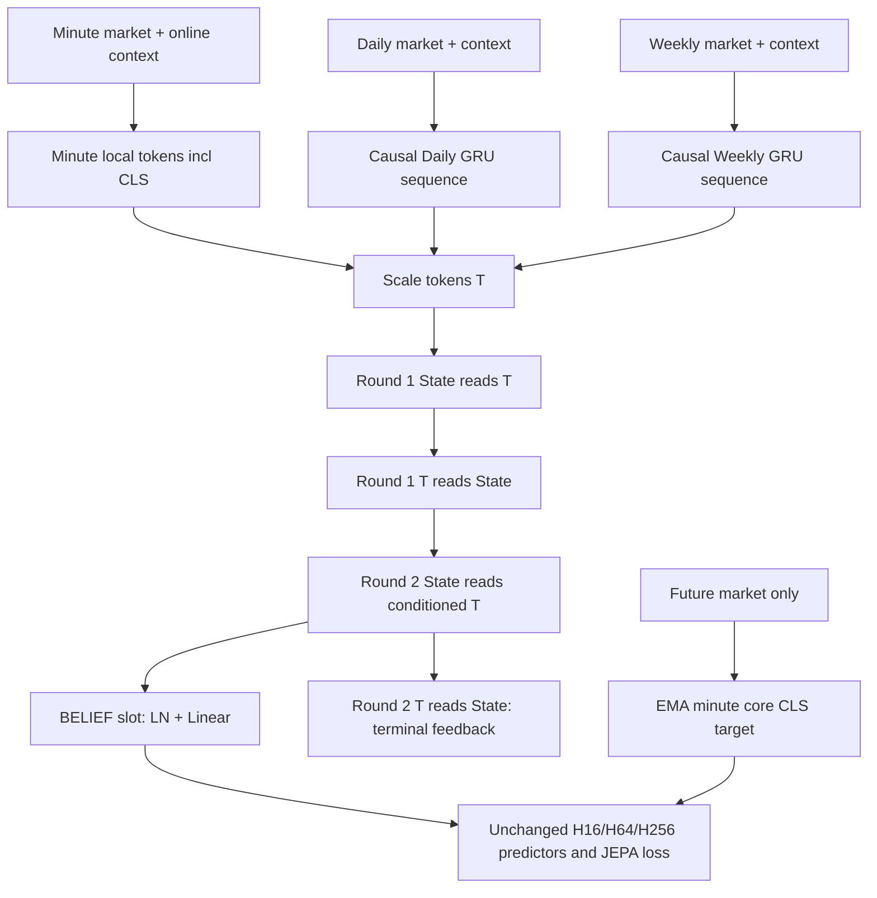

# Market JEPA V1.0 implementation plan

Status: implementation, documentation, self-review, CUDA smoke and Train-only smoke completed. Acceptance verdict: **V1_ARCHITECTURE_IMPLEMENTATION_PASS**. The authorized host run completed 115/115 tests with no skips, including all 29 V1 tests and the previously sandbox-blocked V0 multiworker regression. Source: root `tasks2.md`; both architecture rationale and IMC mathematical design read in full. V1 is architecture development only, not a formal experiment.

## Existing V0 components (observed code)

- `market_jepa/model/encoders.py`: `MinuteMarketEncoder` (4-layer Transformer, CLS-only output), `TemporalContextEncoder` (minute context GRU), `PeriodEncoder` (packed GRU, final hidden only), `MarketEncoder` (544→512→256 late fusion).
- `market_jepa/model/jepa.py`: `MarketJEPA`, `Predictor`, `jepa_loss`; frozen market-only EMA minute encoder, H16/H64/H256 cosine objective.
- `market_jepa/data/pipeline.py`: `prepare_market_data`, `MarketData.daily_snapshot/weekly_snapshot`, train-fitted `NormalizerBundle`. `market_jepa/data/dataset.py`: `MarketDataset`, `build_split_indices`, `collate_market_batch`.
- `market_jepa/train/trainer.py`: `Trainer`, deterministic/RNG helpers, AdamW, warmup/cosine scheduler, AMP overflow-aware optimizer/EMA steps and strict resume.
- `market_jepa/train/checkpoint.py`: atomic save/load. `export_market_latents.py`: `export_split`; `market_jepa/eval/pipeline.py`: existing evaluation functions.

## Reused unchanged / new components / shared changes

Reuse V0 sinusoidal positions, Predictor, JEPA loss, data construction, normalizers, batch collator, atomic checkpoint IO, deterministic/RNG helpers and training update behavior without editing V0 files. Add independent `market_jepa_v1` package: config, sequence encoders, cross-scale model, batch adapter, training/checkpoint integration and development smoke runner. Use `configs/v1/market_jepa_v1.yaml` and a separate root development entrypoint.

No shared-file modifications are planned. V0's implementation manifest includes every `market_jepa/**/*.py` and top-level `configs/*.yaml`; even adding files there invalidates exact resume. The independent package and nested config avoid this. Capture the pre-change V0 manifest/count/output reference and run V0 resume/export/evaluation regressions. V1 checkpoints have a separate manifest that also fingerprints reused V0 code.

## Frozen architecture and data contract

Official V1: design_version="1.0", d_model=belief_dim=256, heads=8, FFN=1024, minute layers=4, Daily/Weekly GRU layers=2 and hidden=128, K=8, rounds=2, dropout=0.1, predictor hidden=512, EMA tau=0.996. No commodity inputs/modules. Feature dimensions are config fields: existing-data profile 14/5/14/1/14/1; independent IMC-shape coverage uses seven market coordinates. IMC calculation remains upstream.

Forward accepts a tensor-only mapping: minute_market [B,M,Fm], minute_context [B,M,Cm], daily_market/context [B,D,Fd/Cd], weekly_market/context [B,W,Fw/Cw], optional boolean padding masks [B,M/D/W] (True=padding), targets[h] [B,h,Fm], optional target masks and persistence arrays/masks. Existing collated V0 batches are converted by an explicit adapter which slices the period feature groups, derives masks from lengths and removes metadata/outcomes; it does not feed identity or future context into the model.

Minute market projection plus separate online-only context projection enter the local Transformer before compression. Market-only core owns market projection, scale embedding, CLS, positional encoding and Transformer; EMA copies only that core and pools its normalized CLS. Online context projection is outside the EMA subtree. Daily/Weekly GRUs consume market+context, retain the causal sequence, project 128→256 and add scale embeddings. Support right/left/interior padding by compacting valid GRU steps and scattering back; zero padded outputs and exclude padded keys. Reject empty market histories; allow fully missing Daily/Weekly scales with masked zero tokens. Positions count valid minute tokens.

Each of two independently parameterized cross-scale blocks executes pre-norm residual State←T attention + FFN, then T←State attention + shared-across-scales FFN. Both full rounds are retained, as explicitly confirmed by the user. The second round's feedback does not feed belief or JEPA loss; its parameters consequently have no loss gradient. This is recorded and tested, not concealed by an auxiliary objective or an extra read. Final belief is LayerNorm then Linear on State slot 0. rounds=0 is debug-only: bypass every interaction block and pool the minute CLS through the belief head; not a formal ablation result.

Outputs retain `z_market`, `predictions`, `targets` for the unchanged loss/training metric interface. `return_intermediates=False` by default; opt-in returns local sequences, per-round states/feedback, token boundaries/mask and final_belief without detaching, enabling gradient audits. No retained debug tensors on module attributes.

## Training, checkpoint and validation

Provide a bounded development entrypoint, CPU/CUDA synthetic smoke at B=2 and B=8 using the full architecture and M=512; fixed-seed JM Train-only smoke defaults to 100 successful optimizer updates, B=2, no validation or best-checkpoint selection. Limit source loading with existing max_trading_day, choose the first 30 observed training days, and purge future tails. Preserve the 14-feature upstream V0 representation for this compatibility smoke; do not claim it is a trained IMC model. AdamW/loss/clipping/EMA defaults match V0. Finite-loss/gradient checks fail visibly; skipped AMP steps do not advance scheduler, EMA or step. Save and restore model (including EMA), complete architecture and six dimensions, optimizer, scheduler/scaler, step, RNG, normalization/schema, source and implementation provenance. Reject mismatched version/config before strict state loading. Resume must reproduce the next optimizer step.

Test shapes; independent dimensions including IMC-shaped inputs; no future-context target; context/Daily/Weekly intervention effects; both Daily and Weekly feedback into non-CLS minute tokens before round 2; finite nonzero gradients for non-CLS minute, intermediate period tokens, context projection and state slots; all padding positions/empty periods; rounds=0 bypass; no identity constructor/forward/state keys; exact EMA and frozen target; strict checkpoint roundtrip/resume; causal anchor/purge integrity; unchanged V0 manifest and legacy training/export/evaluation. Run targeted tests first, then the complete existing and new suite. GPU measurements require real accessible CUDA, otherwise report unavailable with diagnostic evidence, never invented VRAM.

## Deliverables and self-review

Count V0/V1 trainable parameters, each subsystem and EMA separately; stop if ratio >3. Produce `docs/MARKET_JEPA_V1_ARCHITECTURE_IMPLEMENTED.md` and `artifacts/evaluation/v1_architecture_development/{summary.md,summary.json,parameter_counts.json,smoke_test.json,test_results.txt}`. Review actual information flow, terminal feedback, EMA isolation, objective preservation, identity absence, parameter ratio and V0 diffs after tests; fix found defects and rerun affected checks. Only report implementation PASS if required architecture, regression, checkpoint and smoke gates pass; list unavailable checks explicitly. Stop after development verification; no held-out RB, formal multi-commodity training or V0/V1 benchmark.

Execution environment: `/home/v/Documents/work/market_jepa/.venv/bin/python`; ordinary user permissions. Existing untracked `tasks2.md` and `codex-auto-resume.log` belong to the user.

Final verification notes: the V0 manifest is byte-for-byte unchanged; full-size CUDA B=2/B=8 steps and 100 JM Train optimizer updates passed. The final checkpoint matches the current V1 source manifest. Initial scale 65,536 produced nonfinite FP16 gradients before any update; a deterministic calibration replay selected 32,768, after which all successful steps were finite and none were skipped. Calibration preserves parameters, optimizer state and RNG and is covered by a CUDA test. The sandbox-only IPC failure was resolved by running the unchanged V0 multiworker regression in the authorized host environment. No V0 source/config/test assertion was edited. Final evidence is in `artifacts/evaluation/v1_architecture_development/`.
